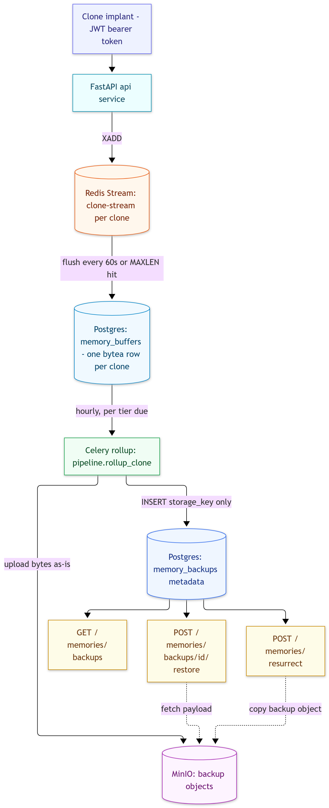
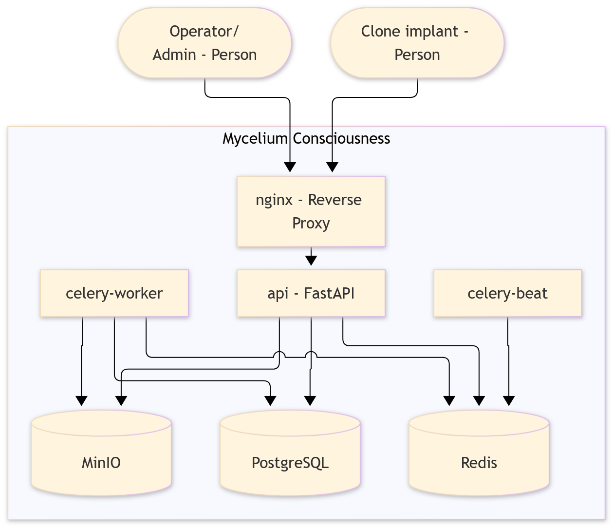

# Mycelium Consciousness

Mycelium Consciousness is a high-load memory synchronization system for clone
implants, modeled on a surveillance camera rather than a search engine: each
clone writes a continuous stream of raw memory frames, and the system never
reads that stream back for the clone's own benefit. What it does instead is
periodically fold the buffered stream into a durable backup, so a clone can be
restored to a past state after it fails. There is no semantic search, no
embeddings, and no read path inside the system at all — only write, roll up,
and restore.

## Architecture



### C4 container diagram



```
Clone (JWT, same auth as REST)
  |  POST /memories/write  {"content": "..."}
  v
FastAPI  ->  XADD  ->  Redis Stream "clone-stream:{clone_id}"
                          |                     |
                          |          length >= MEMORY_STREAM_MAXLEN?
                          |          --> immediate one-clone flush (async)
                          |
                          | celery-beat, every STREAM_FLUSH_INTERVAL_SECONDS
                          | (default 60s), drains every clone's stream
                          v
              memory_buffers (Postgres) — one row per clone, a bytea column
              of msgpack+gzip entries appended in place on every flush
                          |
                          | celery-beat checks hourly which clones are due
                          | for a rollup, per their subscription tier
                          v
              upload the buffer's bytes to MinIO as-is (already encoded)
              INSERT memory_backups row (storage_key only) -> DELETE the buffer
              (one Postgres transaction, after the upload succeeds)
                          |
                          v
              GET /memories/backups            (list)
              POST /memories/backups/{id}/restore
              POST /memories/resurrect         (seed a new clone from a dead one)
              POST /admin/clones/{id}/rollup   (force one clone now, ops/testing)
```

Main components:

- `services/api` — FastAPI: auth, profiles, the fast write endpoint, and
  backup listing/restore.
- Redis — the hot buffer for each clone's raw stream (`clone-stream:{id}`),
  the safety-valve trigger for an out-of-band flush, and the Celery broker.
- `services/celery` — `celery-worker` runs the flush and rollup tasks,
  `celery-beat` triggers both on their own schedules
  (`STREAM_FLUSH_INTERVAL_SECONDS`, `ROLLUP_CHECK_INTERVAL_SECONDS`).
- PostgreSQL — durable storage for users, clone profiles, live
  `memory_buffers` (flushed out of Redis, not yet backed up), and
  `memory_backups` metadata. No vector extension: nothing here is searched.
- MinIO (or any S3-compatible service) — the actual backup archives.
  `memory_backups` rows only hold a pointer (`storage_key`); the payload
  itself never touches the relational database.

### Two buffering stages, two different reasons

`POST /memories/write` never touches Postgres — it's one `XADD`, so the write
path stays fast under load regardless of database contention. That buffer is
bounded two ways: a scheduled flush every `STREAM_FLUSH_INTERVAL_SECONDS`
(default 60s) drains every clone's stream into `memory_buffers`, and if a
single clone's stream reaches `MEMORY_STREAM_MAXLEN` (default 10,000) before
its turn, the write that crossed the threshold fires an immediate one-clone
flush in the background rather than waiting for the schedule or letting the
stream grow further. Redis has `--appendonly yes` with a mounted volume, so
this buffer survives a container restart; it just isn't meant to hold data
for long.

`memory_buffers` in Postgres is the second, coarser buffer: everything
flushed out of Redis lives there, durable, until its clone's subscription
tier says it's time for a backup rollup (see below). This second stage is
what actually absorbs a slow or paused rollup schedule — Postgres can hold
far more than Redis's working-memory footprint without risking the whole
service.

### Subscription tiers

How often a clone is backed up, and how many backups are kept, comes from its
subscription tier (`shared.subscriptions`):

| Tier | Backup frequency | Backups retained | Effective restore depth |
| --- | --- | --- | --- |
| free | monthly | 1 | ~30 days |
| standard | weekly | 4 | ~28 days |
| premium | daily | 30 | ~30 days, day by day |

A cheaper tier does not lose data between backups — writes keep accumulating
in `memory_buffers` regardless of tier — it just gets folded into fewer,
coarser-grained backups, and older ones are pruned sooner (both the
`memory_backups` row and its object in MinIO).

### Backup history and resurrection

Each rollup inserts a new `memory_backups` row rather than overwriting the
previous one, so a clone's past periods stay listed (`GET
/memories/backups`) and restorable (`POST /memories/backups/{id}/restore`)
independently of whatever the current, not-yet-backed-up period in
`memory_buffers` holds. Retention (see the table above) only prunes the
*oldest* rows past the tier's count, using the tier each backup was actually
taken under — a later downgrade never deletes backups already made under a
richer tier.

A dead clone's last backup can seed a brand-new identity —
`POST /memories/resurrect {"source_profile_id": ...}` copies the source
clone's latest backup into the caller's own history as an already-restored
entry. The source must first be marked non-`"active"` (`PATCH
/profiles/{id}` with a `status` such as `"deceased"`, by its owner or an
admin) — resurrecting from a clone that is still active is rejected with
409, so a second identity can never fork off memory that is still live.

## Development

Install dependencies and run quality checks:

```bash
uv sync --all-packages --dev

uv run ruff check .
uv run ruff format --check .
uv run pre-commit run --all-files
```

Run local infrastructure:

```bash
cp infra/.env.example infra/.env
docker compose -f infra/docker-compose.yaml up --build
```

The stack is reached through nginx on `http://localhost` — `GET /health` for
the API. The `migrate` service applies Alembic migrations to completion before
`api`, `celery-worker`, and `celery-beat` start.

Scale the stateless API horizontally:

```bash
docker compose -f infra/docker-compose.yaml up --scale api=3
```

Database migrations:

```bash
uv run alembic -c shared/alembic.ini upgrade head
uv run alembic -c shared/alembic.ini check    # fails if models drift from schema
```

Run the tests (needs reachable Postgres, Redis, and MinIO instances):

```bash
uv sync --all-packages --dev --group test
uv run pytest
```

Tests live in `tests/` at the workspace root because they span `api`,
`celery_worker` and `shared`. They create and drop their own
`${POSTGRES_DB}_test` database and refuse to run against one whose name does
not contain `test`; the same guard applies to `MINIO_BUCKET`, since a
`clean_object_storage` fixture wipes the whole bucket before and after every
test — point it at something like `memory-backups-test`, not a real one. A
`clean_redis_streams` fixture clears only keys under the `clone-stream:`
prefix before and after each test, so it's safe to point at a shared Redis
instance without a similar guard.

After recreating or scaling `api`, reload the gateway so it re-resolves the
upstream address:

```bash
docker compose -f infra/docker-compose.yaml restart nginx
```

### Load-testing the write path

`tools/load_generator.py` simulates an implant writing large volumes of noise
through the real authenticated HTTP path — the only write path there is now:

```bash
uv run --with httpx python tools/load_generator.py \
  --base-url http://localhost --email alpha@clones.example.com \
  --password alphapass123 --rate 200 --duration 30 --concurrency 20
```

It reports throughput and p50/p99 latency. Every write is one `INSERT` into
`memory_buffers`, so this doubles as the write path's real ceiling — there is
no separate low-level path to compare it against anymore.

## Users, roles and access control

Authentication lives in a `users` table linked one-to-one to `clone_profiles`,
so credentials stay off the domain entity on the ingestion hot path. The link
is nullable and unique: a clone owns exactly one profile, while an admin owns
none rather than carrying a synthetic one. Two roles: `clone` (regular user)
and `admin` (operator).

Access control runs on two axes. Vertical (`require_role`) separates privilege
levels and answers 403, not 401, to an authenticated caller with the wrong
role. Horizontal checks resolve ownership from the token subject, never from
the path, and listing endpoints filter by owner inside the SQL query.

Tokens are stateless JWTs, so the API scales horizontally without a shared
session store; the user is re-read on every request, which makes deactivation
take effect immediately rather than at token expiry.

| Endpoint | Anonymous | Clone | Admin |
| --- | --- | --- | --- |
| `POST /auth/register` | 201 | – | – |
| `POST /auth/login` | 200 / 401 | – | – |
| `GET /me/home` | 401 | 200 | 403 |
| `GET /admin/home` | 401 | 403 | 200 |
| `GET /profiles/me` | 401 | 200 | 403 |
| `PATCH /profiles/{id}` | 401 | own only, else 403 | any |
| `POST /memories/write` | 401 | 202 (own stream) | 403 |
| `GET /memories/backups` | 401 | own only | 403 |
| `POST /memories/backups/{id}/restore` | 401 | own only, else 404 | – |
| `PATCH /admin/clones/{id}/subscription` | 401 | 403 | 200 |
| `GET /admin/*` | 401 | 403 | 200 |

Admins cannot self-register; seed one out of band:

```bash
uv run --package api seed-admin ops@example.com <password>
```

## Project reports

- [`docs/bottleneck-analysis.md`](docs/bottleneck-analysis.md) — theoretical
  analysis of at least three potential degradation points under high load.
- [`docs/raci-matrix.md`](docs/raci-matrix.md) — responsibility matrix and
  module breakdown for the two-person team.
