# Mycelium Consciousness

Mycelium Consciousness is a high-load memory synchronization system for clone
implants. I chose this domain because it naturally requires data-intensive
architecture decisions: continuous ingestion, async processing, durable storage,
semantic vector search, caching, and horizontal scaling.

The system receives binary memory frames from clone implants, buffers them
through Redis, processes micro-batches in background workers, enriches memories
with embeddings, and stores metadata plus vectors in PostgreSQL with pgvector.
An administrative FastAPI service exposes health and future CRUD operations for
operators.

## Architecture



Main components:

- Clone implants stream memory frames over HTTP/2 gRPC.
- Nginx acts as an API gateway and load-balancing entry point.
- `services/grpc_ingester` accepts streaming memory payloads.
- Redis is used as a broker/cache between ingestion and processing.
- `services/celery` processes queued micro-batches asynchronously.
- PostgreSQL with pgvector stores clone profiles, memory chunks, and embeddings.
- `services/api` provides the administrative REST API.

## Development

Install dependencies and run quality checks:

```bash
uv sync --all-packages --dev --group codegen

# Protobuf stubs are generated, not committed. Required before running the
# ingester locally; the Docker build does this itself.
uv run python -m shared.protos.generate

uv run ruff check .
uv run ruff format --check .
uv run pre-commit run --all-files
```

Run local infrastructure:

```bash
cp infra/.env.example infra/.env   # then fill in GEMINI_API_KEY
docker compose -f infra/docker-compose.yaml up --build
```

The stack is reached through nginx on `http://localhost` — `GET /health` for the
admin API, and the `memory_stream.MemoryStream` service over HTTP/2 for implant
streams. The `migrate` service applies Alembic migrations to completion before
`api` and `celery-worker` start.

Scale the stateless services horizontally:

```bash
docker compose -f infra/docker-compose.yaml up --scale api=3 --scale grpc-ingester=2
```

Database migrations:

```bash
uv run alembic -c shared/alembic.ini upgrade head
uv run alembic -c shared/alembic.ini check    # fails if models drift from schema
```

Run the tests (needs a reachable pgvector database):

```bash
uv sync --all-packages --dev --group test
uv run pytest
```

Tests live in `tests/` at the workspace root because they span `api`,
`celery_worker`, `grpc_ingester` and `shared`. They create and drop their own
`${POSTGRES_DB}_test` database and refuse to run against one whose name does not
contain `test`.

After recreating or scaling `api` or `grpc-ingester`, reload the gateway so it
re-resolves the upstream address:

```bash
docker compose -f infra/docker-compose.yaml restart nginx
```

## Users, roles and access control

Authentication lives in a `users` table linked one-to-one to `clone_profiles`,
so credentials stay off the domain entity on the ingestion hot path. The link is
nullable and unique: a clone owns exactly one profile, while an admin owns none
rather than carrying a synthetic one. Two roles: `clone` (regular user) and
`admin` (operator).

Access control runs on two axes. Vertical (`require_role`) separates privilege
levels and answers 403, not 401, to an authenticated caller with the wrong role.
Horizontal checks resolve ownership from the token subject, never from the path,
and listing endpoints filter by owner inside the SQL query.

Tokens are stateless JWTs, so the API scales horizontally without a shared
session store; the user is re-read on every request, which makes deactivation
take effect immediately rather than at token expiry.

| Endpoint | Anonymous | Clone | Admin |
| --- | --- | --- | --- |
| `POST /auth/register` | 201 | – | – |
| `POST /auth/login` | 200 / 401 | – | – |
| `GET /me/home` | 401 | 200 | 403 |
| `GET /admin/home` | 401 | 403 | 200 |
| `GET /profiles/me` | 401 | 200 | 403 |
| `PATCH /profiles/{id}` | 401 | own only, else 403 | any |
| `POST /memories` | 401 | 201 (own stream) | 403 |
| `GET /memories/search` | 401 | own memories only | 403 |
| `GET /admin/*` | 401 | 403 | 200 |

Admins cannot self-register; seed one out of band:

```bash
uv run --package api seed-admin ops@example.com <password>
```

## gRPC authentication

`StreamMemories` requires the same bearer token as the REST API, attached as
call metadata rather than a per-message field:

```
authorization: Bearer <access_token>
```

A missing or invalid token aborts the call with `UNAUTHENTICATED`; a
validly signed token whose role is not `clone` aborts with
`PERMISSION_DENIED` — the same 401/403 distinction the REST API makes,
translated to gRPC's status codes. The memory owner is always the token's
subject, resolved server-side to that user's `CloneProfile`; the `clone_id`
field on `MemoryFrame` is never used to decide where a frame is written, so a
caller cannot forge another clone's identity by naming it. The transport
itself is still plaintext (`add_insecure_port`) — this closes the
identity-forgery gap, not the eavesdropping one.
