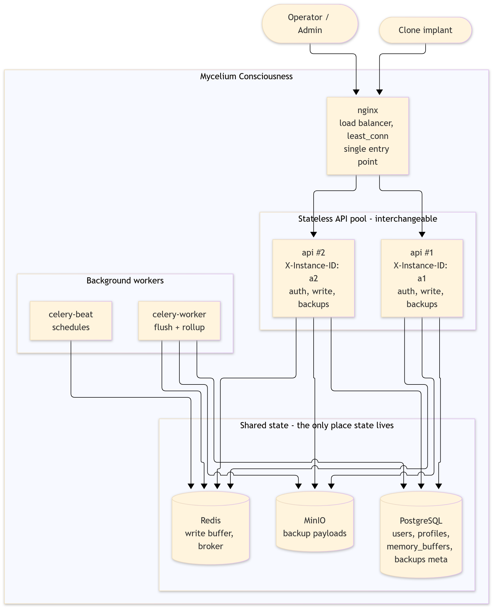
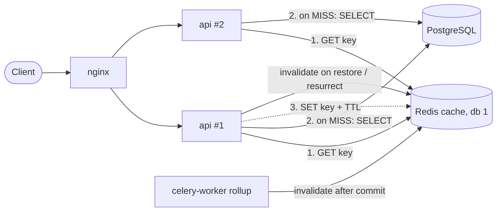

# Mycelium Consciousness

Mycelium Consciousness is a high-load memory synchronization system for clone
implants, modeled on a surveillance camera rather than a search engine: each
clone writes a continuous stream of raw memory frames, and the system never
reads that stream back for the clone's own benefit. What it does instead is
periodically fold the buffered stream into a durable backup, so a clone can be
restored to a past state after it fails. There is no semantic search, no
embeddings, and no read path inside the system at all — only write, roll up,
and restore.

## Architecture


### C4 container diagram


```
Clone (JWT, same auth as REST)
  |  POST /memories/write  {"content": "..."}
  v
FastAPI  ->  XADD  ->  Redis Stream "clone-stream:{clone_id}"
                          |                     |
                          |          length >= MEMORY_STREAM_MAXLEN?
                          |          --> immediate one-clone flush (async)
                          |
                          | celery-beat, every STREAM_FLUSH_INTERVAL_SECONDS
                          | (default 60s), drains every clone's stream
                          v
              memory_buffers (Postgres) — one row per clone, a bytea column
              of msgpack+gzip entries appended in place on every flush
                          |
                          | celery-beat checks hourly which clones are due
                          | for a rollup, per their subscription tier
                          v
              upload the buffer's bytes to MinIO as-is (already encoded)
              INSERT memory_backups row (storage_key only) -> DELETE the buffer
              (one Postgres transaction, after the upload succeeds)
                          |
                          v
              GET /memories/backups            (list)
              POST /memories/backups/{id}/restore
              POST /memories/resurrect         (seed a new clone from a dead one)
              POST /admin/clones/{id}/rollup   (force one clone now, ops/testing)
```

Main components:

- `services/api` — FastAPI: auth, profiles, the fast write endpoint, and
  backup listing/restore.
- Redis — the hot buffer for each clone's raw stream (`clone-stream:{id}`),
  the safety-valve trigger for an out-of-band flush, and the Celery broker.
- `services/celery` — `celery-worker` runs the flush and rollup tasks,
  `celery-beat` triggers both on their own schedules
  (`STREAM_FLUSH_INTERVAL_SECONDS`, `ROLLUP_CHECK_INTERVAL_SECONDS`).
- PostgreSQL — durable storage for users, clone profiles, live
  `memory_buffers` (flushed out of Redis, not yet backed up), and
  `memory_backups` metadata. No vector extension: nothing here is searched.
- MinIO (or any S3-compatible service) — the actual backup archives.
  `memory_backups` rows only hold a pointer (`storage_key`); the payload
  itself never touches the relational database.

### Two buffering stages, two different reasons

`POST /memories/write` never touches Postgres — it's one `XADD`, so the write
path stays fast under load regardless of database contention. That buffer is
bounded two ways: a scheduled flush every `STREAM_FLUSH_INTERVAL_SECONDS`
(default 60s) drains every clone's stream into `memory_buffers`, and if a
single clone's stream reaches `MEMORY_STREAM_MAXLEN` (default 10,000) before
its turn, the write that crossed the threshold fires an immediate one-clone
flush in the background rather than waiting for the schedule or letting the
stream grow further. Redis has `--appendonly yes` with a mounted volume, so
this buffer survives a container restart; it just isn't meant to hold data
for long.

`memory_buffers` in Postgres is the second, coarser buffer: everything
flushed out of Redis lives there, durable, until its clone's subscription
tier says it's time for a backup rollup (see below). This second stage is
what actually absorbs a slow or paused rollup schedule — Postgres can hold
far more than Redis's working-memory footprint without risking the whole
service.

### Subscription tiers

How often a clone is backed up, and how many backups are kept, comes from its
subscription tier (`shared.subscriptions`):

| Tier | Backup frequency | Backups retained | Effective restore depth |
| --- | --- | --- | --- |
| free | monthly | 1 | ~30 days |
| standard | weekly | 4 | ~28 days |
| premium | daily | 30 | ~30 days, day by day |

A cheaper tier does not lose data between backups — writes keep accumulating
in `memory_buffers` regardless of tier — it just gets folded into fewer,
coarser-grained backups, and older ones are pruned sooner (both the
`memory_backups` row and its object in MinIO).

### Backup history and resurrection

Each rollup inserts a new `memory_backups` row rather than overwriting the
previous one, so a clone's past periods stay listed (`GET
/memories/backups`) and restorable (`POST /memories/backups/{id}/restore`)
independently of whatever the current, not-yet-backed-up period in
`memory_buffers` holds. Retention (see the table above) only prunes the
*oldest* rows past the tier's count, using the tier each backup was actually
taken under — a later downgrade never deletes backups already made under a
richer tier.

A dead clone's last backup can seed a brand-new identity —
`POST /memories/resurrect {"source_profile_id": ...}` copies the source
clone's latest backup into the caller's own history as an already-restored
entry. The source must first be marked non-`"active"` (`PATCH
/profiles/{id}` with a `status` such as `"deceased"`, by its owner or an
admin) — resurrecting from a clone that is still active is rejected with
409, so a second identity can never fork off memory that is still live.

## Development

Install dependencies and run quality checks:

```bash
uv sync --all-packages --dev

uv run ruff check .
uv run ruff format --check .
uv run pre-commit run --all-files
```

Run local infrastructure:

```bash
cp infra/.env.example infra/.env
docker compose -f infra/docker-compose.yaml up --build
```

The stack is reached through nginx on `http://localhost` — `GET /health` for
the API. The `migrate` service applies Alembic migrations to completion before
`api`, `celery-worker`, and `celery-beat` start.

Scale the stateless API horizontally:

```bash
docker compose -f infra/docker-compose.yaml up --scale api=3
```

Database migrations:

```bash
uv run alembic -c shared/alembic.ini upgrade head
uv run alembic -c shared/alembic.ini check    # fails if models drift from schema
```

Run the tests (needs reachable Postgres, Redis, and MinIO instances):

```bash
uv sync --all-packages --dev --group test
uv run pytest
```

Tests live in `tests/` at the workspace root because they span `api`,
`celery_worker` and `shared`. They create and drop their own
`${POSTGRES_DB}_test` database and refuse to run against one whose name does
not contain `test`; the same guard applies to `MINIO_BUCKET`, since a
`clean_object_storage` fixture wipes the whole bucket before and after every
test — point it at something like `memory-backups-test`, not a real one. A
`clean_redis_streams` fixture clears only keys under the `clone-stream:`
prefix before and after each test, so it's safe to point at a shared Redis
instance without a similar guard.

After recreating or scaling `api`, reload the gateway so it re-resolves the
upstream address:

```bash
docker compose -f infra/docker-compose.yaml restart nginx
```

### Load-testing the write path

`tools/load_generator.py` simulates an implant writing large volumes of noise
through the real authenticated HTTP path — the only write path there is now:

```bash
uv run --with httpx python tools/load_generator.py \
  --base-url http://localhost --email alpha@clones.example.com \
  --password alphapass123 --rate 200 --duration 30 --concurrency 20
```

It reports throughput and p50/p99 latency. Every write is one `INSERT` into
`memory_buffers`, so this doubles as the write path's real ceiling — there is
no separate low-level path to compare it against anymore.

## Users, roles and access control

Authentication lives in a `users` table linked one-to-one to `clone_profiles`,
so credentials stay off the domain entity on the ingestion hot path. The link
is nullable and unique: a clone owns exactly one profile, while an admin owns
none rather than carrying a synthetic one. Two roles: `clone` (regular user)
and `admin` (operator).

Access control runs on two axes. Vertical (`require_role`) separates privilege
levels and answers 403, not 401, to an authenticated caller with the wrong
role. Horizontal checks resolve ownership from the token subject, never from
the path, and listing endpoints filter by owner inside the SQL query.

Tokens are stateless JWTs, so the API scales horizontally without a shared
session store; the user is re-read on every request, which makes deactivation
take effect immediately rather than at token expiry.

| Endpoint | Anonymous | Clone | Admin |
| --- | --- | --- | --- |
| `POST /auth/register` | 201 | – | – |
| `POST /auth/login` | 200 / 401 | – | – |
| `GET /me/home` | 401 | 200 | 403 |
| `GET /admin/home` | 401 | 403 | 200 |
| `GET /profiles/me` | 401 | 200 | 403 |
| `PATCH /profiles/{id}` | 401 | own only, else 403 | any |
| `POST /memories/write` | 401 | 202 (own stream) | 403 |
| `GET /memories/backups` | 401 | own only | 403 |
| `POST /memories/backups/{id}/restore` | 401 | own only, else 404 | – |
| `PATCH /admin/clones/{id}/subscription` | 401 | 403 | 200 |
| `GET /admin/*` | 401 | 403 | 200 |

Admins cannot self-register; seed one out of band:

```bash
uv run --package api seed-admin ops@example.com <password>
```

## Project reports

- [`docs/bottleneck-analysis.md`](docs/bottleneck-analysis.md) — theoretical
  analysis of at least three potential degradation points under high load.
- [`docs/raci-matrix.md`](docs/raci-matrix.md) — responsibility matrix and
  module breakdown for the two-person team.

## Lab 2 — Stateless architecture



### State audit

| Category | What | Where it lives |
| --- | --- | --- |
| Ephemeral / local safe | request-scoped DB session, logs, `INSTANCE_ID` (read once from env/hostname, never mutated) | process memory, discarded per request |
| Shared / externalized | users, profiles, subscription tier, buffered memory, backup metadata | Postgres |
| Shared / externalized | hot write buffer (`clone-stream:{id}`), Celery broker | Redis |
| Shared / externalized | backup payloads | MinIO |
| Shared / externalized | auth state | none — stateless JWT, user re-read from Postgres on every request |
| Critical stateful (removed / absent) | in-memory collections, local caches, app-level locks, local counters, file sessions | none in the API; the only lock is Postgres `SELECT ... FOR UPDATE` on `memory_buffers` |

In-memory dependencies eliminated: the write buffer is Redis, not a process
list; flush serialization uses a row lock in Postgres, not a Python lock;
sessions are JWTs, not server-side files or dicts.

### Request flow (`POST /memories/write`)

1. Input: `Authorization: Bearer <JWT>` + `{"content": ...}`; `clone_id` is
   resolved from the token, never from the body.
2. Context read: user + profile from Postgres.
3. Atomic state change: one Redis `XADD` (returns stream length).
4. Nothing is retained in the process afterwards.

### Multi-instance run and identification

```bash
docker compose -f infra/docker-compose.yaml up -d --build --scale api=2
docker compose -f infra/docker-compose.yaml restart nginx   # re-resolve upstream
```

Every response carries `X-Instance-ID` (container hostname, overridable via
`INSTANCE_ID`); `GET /health` also returns it.

```bash
for i in 1 2 3 4; do curl -si http://localhost/health | grep -i x-instance-id; done
```

### Cross-instance consistency (no sticky sessions)

`scripts/cross_instance_check.sh` registers a clone, then alternates
`GET /profiles/me` and `PATCH /profiles/{id}` through nginx (`least_conn`, no
`ip_hash`) and prints the serving instance for each call plus the status read
back, which must match what was just written regardless of instance.

### Instance-loss scenario

```bash
docker compose -f infra/docker-compose.yaml ps api          # note both names
docker stop <one api container>                              # mid-run
bash scripts/cross_instance_check.sh                         # still succeeds, served by the survivor
```

Writes already accepted are in Redis/Postgres, not in the stopped process, so
nothing is lost; nginx's passive check (`max_fails=3 fail_timeout=15s`) drops
the dead upstream. Restart nginx after re-scaling (upstream IPs are resolved
at startup).

### Stateless vs. no data, and hidden affinity

Stateless means the *process* holds no per-client state — data still exists,
in shared stores. Hidden affinity risks: in-process caches or counters,
local files, node-local locks, and anything that only works because the
same client keeps hitting the same node.

## Lab 3 — Horizontal scaling and load balancing

### Topology

Clients reach only nginx (`:80`); `api` replicas publish no host ports, so the
upstream pool is unreachable from outside the compose network. The pool and
algorithm come from two env vars rendered into
`infra/nginx/default.conf.template`:

| Env var | Default |
| --- | --- |
| `LB_ALGORITHM` | `least_conn;` (empty string = round robin, `ip_hash;`) |
| `LB_SERVERS` | `server api:8000 max_fails=3 fail_timeout=15s;` |

Switch live: `LB_ALGORITHM="ip_hash;" docker compose -f infra/docker-compose.yaml up -d --no-deps --force-recreate nginx`.
`api-slow` (same image, `SIMULATED_LATENCY_MS`, compose profile `slow`) is the
degraded node for the asymmetric experiment.

Health: `GET /health` checks Postgres, Redis and MinIO (2s timeout each) and
returns **503** with per-dependency status when any fails. nginx does *passive*
health checking (`max_fails`/`fail_timeout` plus `proxy_next_upstream`);
open-source nginx has no active probes — that needs HAProxy/Traefik/nginx Plus.

Reproduce everything: `scripts/lb_experiments.sh {distribution|asymmetric|scaleout|failover}`
(uses `tools/lb_bench.py`). Environment: one Windows/Docker Desktop laptop,
`API_WORKERS=2` per replica, load generator on the same host (so absolute
numbers are only comparable to each other, not to a real deployment).

### Algorithm comparison (1 fast node + 1 node with 300 ms added latency, 30 workers, 20 s)

| Algorithm | RPS | p50 ms | p95 ms | p99 ms | Share to slow / fast |
| --- | --- | --- | --- | --- | --- |
| round robin | 169 | 324 | 340 | 409 | 50% / 50% |
| least_conn | 139 | 129 | 590 | 885 | 23% / 77% |
| weighted RR (fast=3, slow=1) | 142 | 117 | 579 | 848 | 25% / 75% |
| ip_hash | 87 | 338 | 375 | 467 | 100% / 0% (single client) |

Reading it honestly: `least_conn` and weighted RR do what they should —
they steer ~75% of traffic away from the slow node and cut the median from
324 to ~120 ms. But **round robin has the better p99 and throughput here**,
because the "slow" node's delay is a sleep that burns no CPU, while the fast
node (2 workers, sharing the host with the generator, Postgres and Redis)
saturates when it takes three quarters of the load. So the tail latency of the
weighted/least_conn runs is queueing on the fast node, not on the slow one.
Least-connections wins when the slowness is real (CPU-bound or slow I/O on a
node with the same capacity); here it does not. `ip_hash` gives session
affinity — with one client it pins everything to one node, the worst case for
distribution and exactly the affinity lab 2 removed the need for.
Equal replicas, 200 sequential requests: RR 94/106, least_conn 94/106 —
with no concurrency, `least_conn` degenerates to round robin.

### Scale-out (least_conn, 30 workers, 20 s)

| Instances | Write RPS | Write p99 ms | Read (`/profiles/me`) RPS | Read p99 ms |
| --- | --- | --- | --- | --- |
| 1 | 88 | 2309 | 121 | 1154 |
| 2 | 121 | 1624 | 162 | 823 |
| 3 | 120 | 1605 | 169 | 809 |

1→2 replicas gives +37% writes / +34% reads; 2→3 gives essentially nothing.
**The next bottleneck is not the API layer.** Every request runs on the same
Docker host CPU shared with Postgres, Redis, MinIO and the load generator, and
every authenticated request does a Postgres round trip (user + profile
lookup) through a per-process connection pool
(`(DB_POOL_SIZE + DB_MAX_OVERFLOW) × processes`, see
`docs/bottleneck-analysis.md`). Adding API processes past two only adds
contention for the same database and CPU. Also visible: p99 is 5–20× p50 at
every size, a queueing signature rather than a slow-node one.

### Node failure under load

`scripts/lb_experiments.sh failover`: 20 workers POSTing `/memories/write`
for 25 s, `docker stop infra-api-2` at t=8s.

| nginx config | Requests | 5xx |
| --- | --- | --- |
| default retry (idempotent methods only) | 4252 | **14 (0.33%)** |
| `proxy_next_upstream … non_idempotent` | 4293 | **0** |

Without `non_idempotent`, nginx will not retry a POST that failed mid-flight,
so the requests in flight on the dying node surfaced as 502. Enabling it fixes
that; the cost is that a write frame may be applied twice if the node died
after processing it but before responding. For this system's append-only
memory stream that is tolerable; for a non-idempotent business operation it
would need an idempotency key instead. After the node came back it re-entered
the pool automatically (`fail_timeout` expiry), no nginx restart.

### The balancer as a single point of failure

The one nginx container is itself a SPOF — the whole API tier can be healthy
and clients still see 100% errors. Remedies: two nginx nodes sharing a virtual
IP via Keepalived/VRRP (active/passive failover in seconds), or DNS round robin
across several balancers (cheap, but DNS caching delays failure detection), or
a cloud L4 load balancer in front of a pair of nginx nodes.

## Lab 4 — Distributed caching (Cache-Aside)

### What is cached and why

This system is write-only by design, so there is exactly one read-heavy
scenario worth caching: **`GET /memories/backups`**, a clone's own backup
history (metadata only — never memory payloads). It is the endpoint a
dashboard or restore UI polls, it is a `ORDER BY period_end DESC LIMIT n`
scan over `memory_backups`, and it changes only on rollup (at most daily on the
premium tier), restore, or resurrect — so reads outnumber writes by orders of
magnitude. Deliberately **not** cached: `/profiles/me` and the auth lookup (a
deactivation must take effect immediately, so those stay on Postgres), backup
payloads (large, fetched once), and anything on the write path.

Acceptable staleness: a missed invalidation may show an out-of-date list for at
most the TTL (60 s); the listing carries no security-relevant data.

### Cache-Aside flow



`HIT` returns straight from Redis; `MISS` reads Postgres, stores the JSON with
a TTL and returns it; `BYPASS` means the cache was unreachable (or the client
sent `Cache-Control: no-cache`) and the answer came from Postgres. Every
response carries `X-Cache: HIT | MISS | BYPASS`.

### Key scheme and TTL

`cache:<version>:<domain>:<entity-id>:<params-hash>`, e.g.
`cache:v1:backups:42:9f2c1a7e` (`params-hash` = first 8 hex of SHA-1 over the
sorted query params, here `limit`). The clone id is part of the key, so one
clone can never read another's entry, and the id-before-hash order lets one
prefix scan drop every variant of one clone. The version segment (`v1`) lets a
response-shape change invalidate everything by bumping it.

| Setting | Value | Why |
| --- | --- | --- |
| TTL | 60 s (`CACHE_BACKUPS_TTL_SECONDS`), ±10% jitter | Safety net for missed invalidation; jitter stops keys created together expiring together (avalanche). |
| Storage | Redis **db 1** on the same container | Separate keyspace from the write-path streams and Celery broker on db 0. |
| Eviction | not set | Cache keys are small and TTL-bounded; a real deployment would set `maxmemory` + `allkeys-lru` on a dedicated cache instance. |

### Invalidation

Every mutation of a clone's backup list drops that clone's keys **after** the
Postgres commit: the rollup (`celery_worker.pipeline.rollup_clone`, which
also covers admin force-rollup and pruning), `POST /memories/backups/{id}/restore`,
and `POST /memories/resurrect`. The next read is a `MISS` with fresh data.
Remaining race: a reader that queried Postgres just before the commit can
re-populate the old list just after the invalidation; the TTL bounds that.

### Fallback (graceful degradation)

Cache calls are fail-open with a 0.5 s socket timeout: any Redis error is
logged and treated as `BYPASS`, and the request is served from Postgres. The
write path does need Redis (it is the stream buffer), but reads keep working.
Try it: `bash scripts/cache_experiment.sh demo`.

### Results (`scripts/cache_experiment.sh demo|bench`)

Demo, one clone with 200 seeded backups: `MISS` → `HIT` → restore →
`MISS` (fresh) → `HIT` → `docker stop redis` → `BYPASS` with HTTP 200 → Redis
restarted → `HIT`.

Single-request latency, curl through nginx: MISS ≈ 17–23 ms, HIT ≈ 13–15 ms.

Load (`limit=200`, 30 workers, 20 s, 2 api replicas, same laptop as the
generator):

| Mode | RPS | p50 ms | p95 ms | p99 ms | Postgres rows read |
| --- | --- | --- | --- | --- | --- |
| cold (`Cache-Control: no-cache`, every request hits Postgres) | 97 | 166 | 1018 | 1530 | 782,691 |
| warm (cache enabled) | 121 | 138 | 758 | 1233 | 53,641 |

The main effect is on the database: **~93% fewer rows read** for the same
traffic. The latency gain is modest (+24% RPS, p50 −17%) because every request
still does the authentication lookup in Postgres (deliberately uncached) and
the client, nginx, api and Postgres all share one host's CPU. On a real
deployment the freed database capacity is the benefit, not the millisecond.
Right after Redis restarts, the first request can still be a `BYPASS` while
the client reconnects.

### Theory notes

- **Expiration vs invalidation:** expiration (TTL) is time-driven and
  best-effort; invalidation is event-driven and exact. We use both: explicit
  invalidation on every mutation, TTL as the backstop.
- **Cache stampede / thundering herd:** when a hot key expires or is
  invalidated, many concurrent readers all miss and hit Postgres at once. Not
  mitigated here beyond the short listing query; the standard fixes are a
  per-key lock / single-flight, or refreshing early.
- **Cache avalanche:** many keys expiring together — mitigated by the TTL jitter.
- **Eviction (LRU/LFU):** what Redis drops when `maxmemory` is reached; LRU
  favours recency, LFU frequency. Unset here (see table above).
