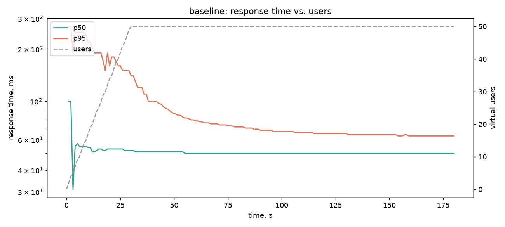
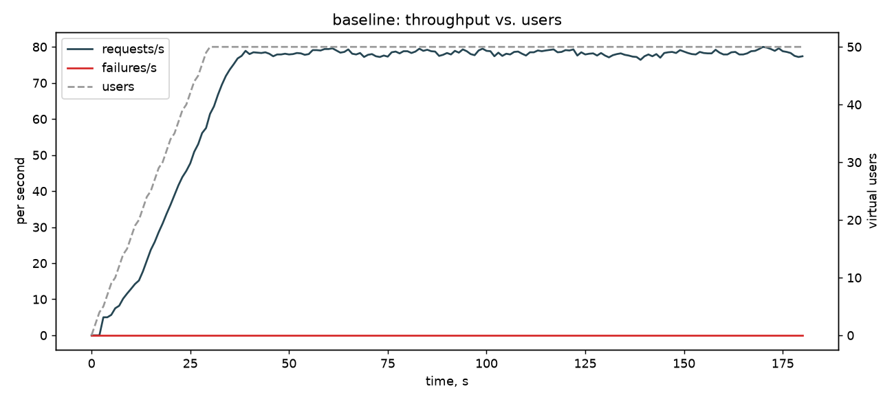
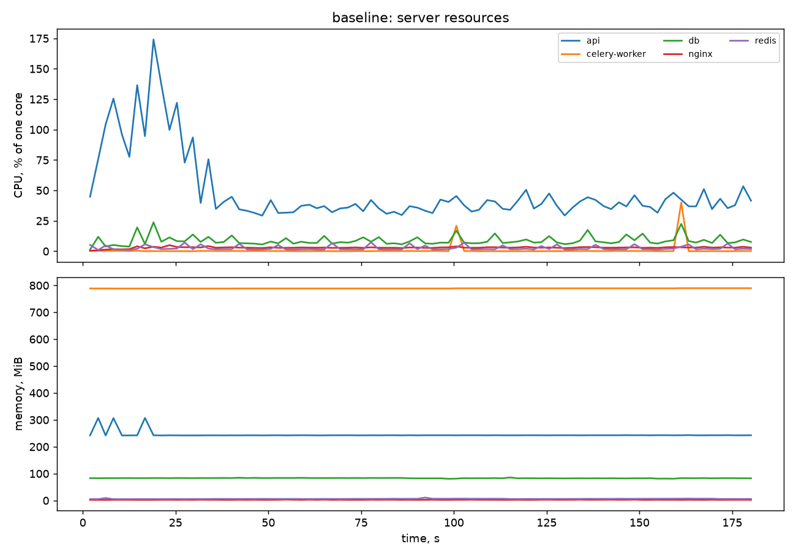
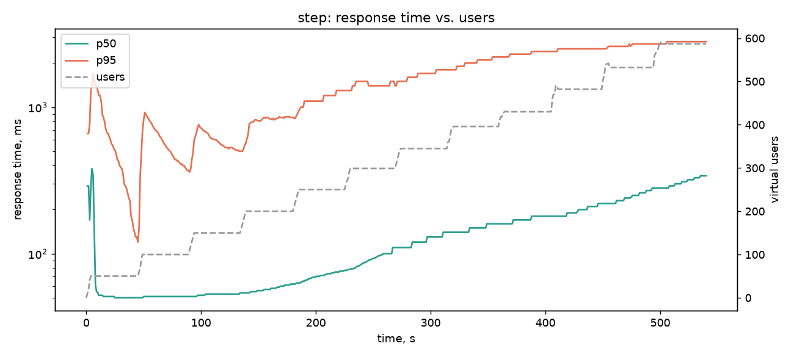
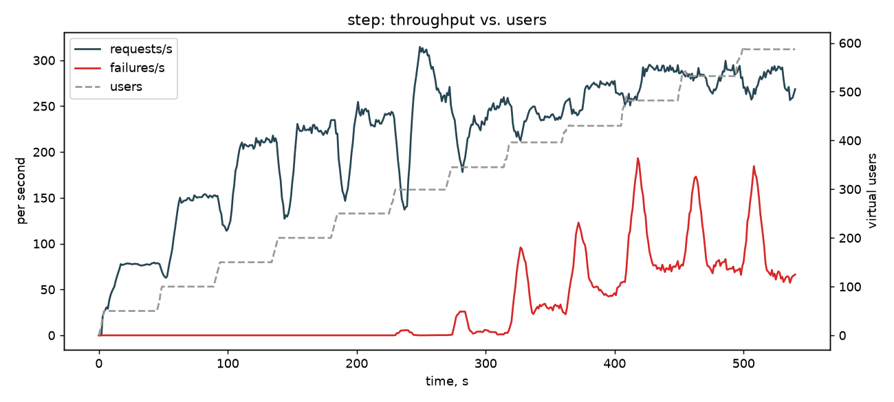
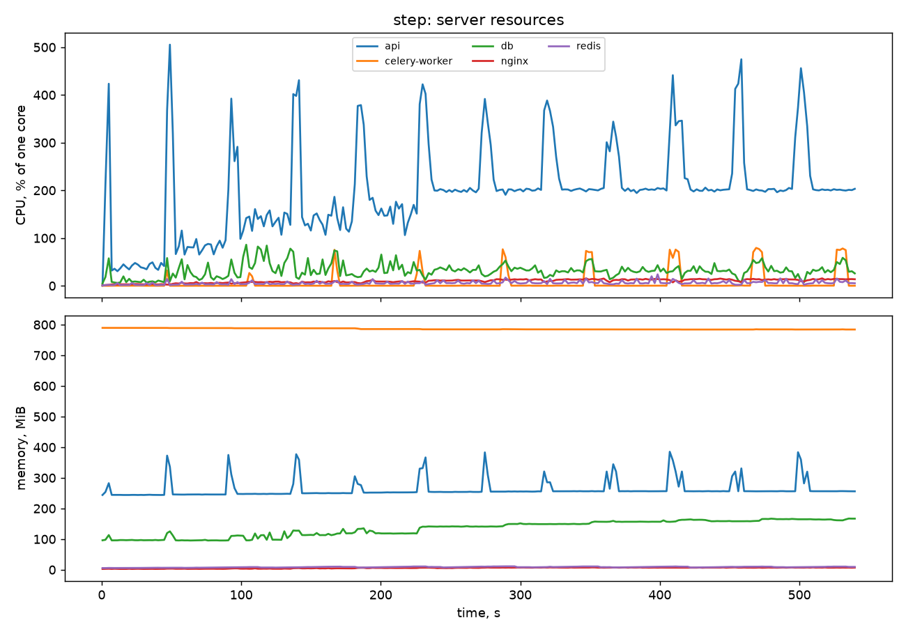

# Лабораторна робота №4 — первинний звіт про навантажувальне тестування

## 1. Планування

**Інструмент: [Locust](https://locust.io) 2.46.** Сценарій пишеться мовою
Python (як і сам проєкт), підтримує ступінчасті профілі (`LoadTestShape`),
на виході дає CSV-історію та HTML-звіт. Код — у [`loadtests/`](../../loadtests/README.md).

**Цільові ендпоінти MVP** (типова сесія клона-імпланта: один логін, далі цикл):

| Ендпоінт | Вага в сценарії | Чому |
| --- | --- | --- |
| `POST /auth/login` | 1 раз на користувача | старт сесії, argon2 |
| `POST /memories/write` | 10 | головний, «гарячий» шлях системи (XADD у Redis) |
| `GET /profiles/me` | 3 | читання з Postgres + авторизація |
| `GET /memories/backups` | 2 | листинг з Postgres |
| `GET /memories/stream/status` | 1 | читання з Redis |
| `GET /health` | 1 | мінімальний запит із SELECT 1 |

Пауза між діями — 0,2–1,0 с (think time). Акаунти реєструються заздалегідь
(`loadtests/provision.py`), щоб вимірювання йшло в сталому режимі.

**Профілі навантаження:**

| Профіль | VUsers | Ramp-up | Тривалість |
| --- | --- | --- | --- |
| `baseline` (контрольний) | 50 | 30 с | 3 хв |
| `step` (пошук межі) | 50 → 600, +50 кожні 45 с | 10 користувачів/с на кроці | 9 хв |

## 2. Стенд

Розгорнуте **sandbox**-середовище (див. ЛР №3), `docker compose`, проєкт
`clone-sandbox`: nginx → **1 репліка `api` (2 процеси uvicorn)**, Postgres 16,
Redis 7, MinIO, `celery-worker`, `celery-beat`. Обмежень CPU/RAM на контейнери
немає. Хост — Windows 11 + Docker Desktop; **Locust (один процес) працює на
тій самій машині**, тож частина ресурсів ділиться з тестованою системою — це
впливає на абсолютні числа (див. застереження в розділі 5).
CPU контейнерів: `docker stats`, 100 % = одне ядро.

## 3. Первинні метрики

### Контрольний запуск (`baseline`, 50 VUsers)

| Метрика | Значення |
| --- | --- |
| Запитів | 13 015 |
| RPS (середній / пік) | 72,2 / 80,0 |
| Latency середня / min / max | 37 / 3 / 357 мс |
| Latency p50 / p95 / p99 | 50 / 63 / 92 мс |
| Error rate | 0,00 % (0 помилок) |

| Ендпоінт | Запитів | Avg, мс | p95, мс | p99, мс | Max, мс | Помилки |
| --- | --- | --- | --- | --- | --- | --- |
| GET /health | 739 | 7 | 12 | 25 | 121 | 0 |
| GET /memories/backups | 1472 | 12 | 23 | 39 | 246 | 0 |
| GET /memories/stream/status | 785 | 11 | 22 | 45 | 153 | 0 |
| GET /profiles/me | 2304 | 10 | 18 | 31 | 297 | 0 |
| POST /auth/login | 50 | 180 | 340 | 360 | 357 | 0 |
| POST /memories/write | 7665 | 55 | 67 | 90 | 296 | 0 |

| Сервіс | CPU середн., % | CPU пік, % | RAM пік, МіБ |
| --- | --- | --- | --- |
| api | 49 | 174 | 307 |
| db | 9 | 24 | 86 |
| celery-worker | 1 | 40 | 790 |
| minio | 2 | 15 | 106 |
| redis | 3 | 7 | 11 |
| nginx | 3 | 5 | 4 |





### Ступінчастий тест (`step`, 50 → 600 VUsers)

Підсумок за весь прогін (119 350 запитів): середній RPS 221, пік 314,6;
latency avg/min/max 811 / 3 / 30 123 мс, p50/p95/p99 = 340 / 2800 / 5000 мс;
error rate **15,49 %** (18 484). Усереднена картина оманлива, тому нижче —
розбивка по кроках (перша третина кожного кроку відкинута: користувачі ще
запускаються).

| VUsers | RPS | p50, мс | p95, мс | Error % | CPU api, % |
| --- | --- | --- | --- | --- | --- |
| 50 | 77 | 50 | 414 | 0,00 | 41 |
| 100 | 149 | 51 | 501 | 0,00 | 83 |
| 150 | 205 | 53 | 561 | 0,00 | 139 |
| 200 | 220 | 59 | 840 | 0,00 | 139 |
| 250 | 234 | 72 | 1183 | 0,00 | 152 |
| 300 | 275 | 96 | 1433 | 0,06 | 199 |
| 350 | 237 | 127 | 1720 | 1,33 | 200 |
| 400 | 240 | 152 | 2083 | 11,48 | 202 |
| 450 | 271 | 176 | 2355 | 18,90 | 201 |
| 500 | 289 | 203 | 2500 | 26,01 | 201 |
| 550 | 282 | 253 | 2669 | 25,93 | 201 |
| 600 | 280 | 316 | 2800 | 23,23 | 201 |

| Ендпоінт | Запитів | Avg, мс | p95, мс | p99, мс | Max, мс | Помилки |
| --- | --- | --- | --- | --- | --- | --- |
| GET /health | 6876 | 767 | 2700 | 4900 | 11 393 | 1082 |
| GET /memories/backups | 13 888 | 777 | 2800 | 4800 | 13 067 | 2193 |
| GET /memories/stream/status | 6984 | 802 | 2900 | 5100 | 10 119 | 1083 |
| GET /profiles/me | 21 003 | 781 | 2800 | 4800 | 30 123 | 3175 |
| POST /auth/login | 783 | 2169 | 6700 | 9900 | 12 209 | 196 |
| POST /memories/write | 69 816 | 817 | 2800 | 4900 | 30 122 | 10 755 |

| Сервіс | CPU середн., % | CPU пік, % | RAM пік, МіБ |
| --- | --- | --- | --- |
| api | 197 | 505 | 385 |
| db | 32 | 86 | 167 |
| celery-worker | 6 | 79 | 790 |
| minio | 3 | 23 | 112 |
| redis | 6 | 24 | 11 |
| nginx | 10 | 16 | 8 |





## 4. Виявлені вузькі місця

**1. API впирається в CPU вже на ~200–300 користувачах (головне).**
Сервіс `api` (2 процеси uvicorn, тобто 2 ядра) виходить на плато
**≈200 % CPU** з кроку 300 VUsers, і далі RPS не росте: 275 → 280 при подвоєнні
користувачів (300 → 600), а p50 зростає майже лінійно, 96 → 316 мс — класична
черга. Це не вузьке місце окремої операції: `GET /health` має таку саму
затримку (avg 767 мс), як і запис (817 мс). Решта компонентів далека від межі:
Postgres — пік 86 % одного ядра, Redis — 24 %, nginx — 16 %. Перші ознаки
деградації — з 200 VUsers (RPS майже не росте: 205 → 220, p95 561 → 840 мс).
Помилки з'являються на 300–350 VUsers і різко (11 % → 26 %) на 400–500.
Комфортна межа для поточної конфігурації: **≈150–200 одночасних клонів,
≈200 RPS**.

**2. Логін (argon2) блокує весь API.** Логін коштує 180 мс (baseline) проти
7–12 мс у решти ендпоінтів, а під ступінчастим навантаженням — avg 2,2 с,
p95 6,7 с, 196 логінів зі 783 завершилися таймаутом 30 с. Кожна хвиля нових
користувачів дає пік CPU `api` 400–500 % (графік ресурсів, зубці кожні 45 с) і
одночасно стрибок p95 для **всіх** запитів. `verify_password` у
`routers/auth.py` виконується синхронно всередині `async`-обробника, тобто
блокує event loop процесу, поки хеш обчислюється. Це вузьке місце при
масовому одночасному підключенні клонів (відновлення після збою, старт зміни).

**3. Відмови на рівні з'єднання, а не HTTP 5xx.** Усі 18 484 помилки —
`RemoteDisconnected`, `ConnectionAbortedError (10053)`, `ConnectionResetError`;
жодної відповіді 5xx не було. Тобто при насиченні API розриваються з'єднання, а
не повертається контрольована помилка (немає ні back-pressure, ні 503).
Застереження: Locust і Docker на одному Windows-хості, тому частку помилок
10053 (розрив на боці хоста) не можна повністю відокремити від поведінки
сервера. Потрібне повторне вимірювання з окремою машиною-генератором і
логами nginx/uvicorn.

**4. Запис повільніший за читання з БД — спостереження для перевірки.**
`POST /memories/write` (avg 55 мс на baseline) у 5 разів повільніший за
`GET /profiles/me` (10 мс), який ходить у Postgres, хоча запис — це лише
`XADD` у Redis. `append_memory` робить два послідовні звернення (`XADD`, потім
`XLEN`), а сталі ~40–50 мс схожі на сигнатуру Nagle/delayed-ACK. Це лише
гіпотеза: у цій ЛР не перевірялась, а далі варто спробувати pipeline з обох
команд.

**5. Фонові задачі помітні, але не критичні.** `celery-worker` раз на 60 с
(flush) стрибає до 70–80 % CPU на кілька секунд; пам'ять Postgres росте
100 → 167 МіБ за тест. Сам воркер у спокої тримає ~790 МіБ RAM — багато для
простоюючого процесу, варто з'ясувати причину.

## 5. Обмеження та наступні кроки

- Один прогін кожного профілю; без повторів оцінка похибки не робилась.
- Генератор навантаження на тому ж хості — результати занижують реальну
  ємність системи й спотворюють джерело помилок (п. 3).
- Тест короткий (9 хв); поведінка буфера Redis/`memory_buffers` та rollup у
  тривалому режимі не перевірялась.
- Наступні експерименти: `docker compose up --scale api=3` (чи лінійно росте
  RPS), винесення argon2 з event loop, pipeline `XADD`+`XLEN`, повтор тесту з
  окремої машини.

## Відтворення

```bash
loadtests/run.sh baseline
loadtests/run.sh step
uv run --group load python loadtests/make_report.py baseline step
```

Сирі CSV та HTML-звіти Locust лежать у `results/` (не комітяться).
